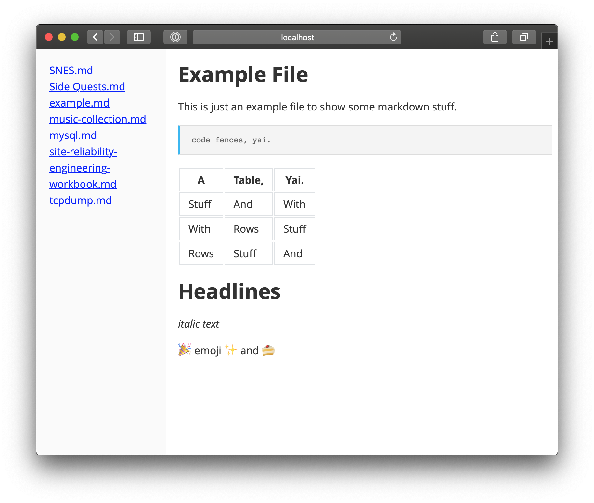

# MarkDokio

... is a single-file app, that lets you view markdown documents in your browser. That's it.

Place files and folders in the  `notes` directory and they automatically appear in the sidebar.
Click on an entry on the left and see markdown on the right. :cake:

## Installation

Put the project files inside your web-root and run `composer install`.

If you have php on your local machine, you can also quickly test this with `php -S 127.1:9001 -t ./`

and goto http://localhost:9001.

## Screenshots

